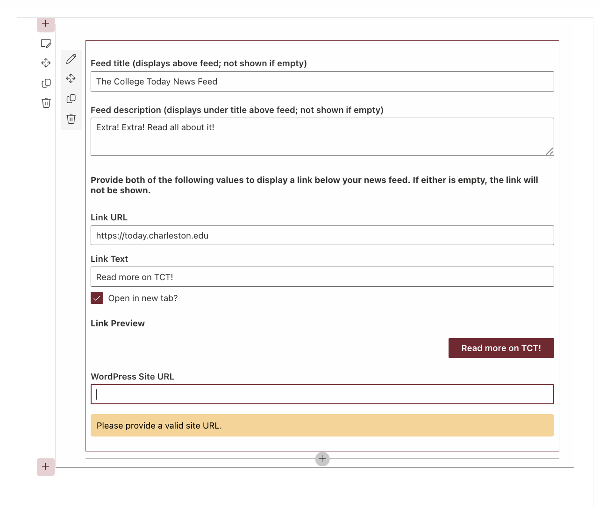
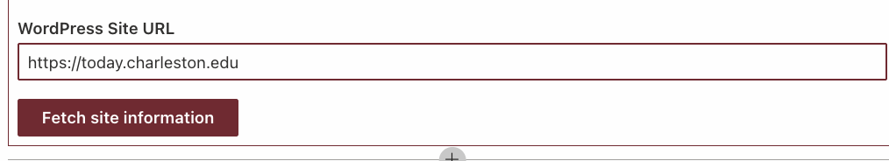
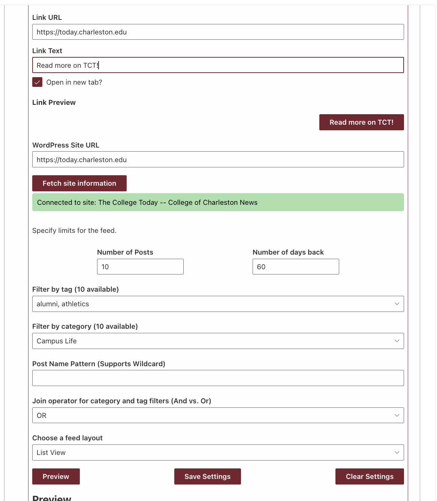
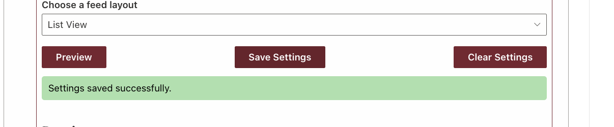
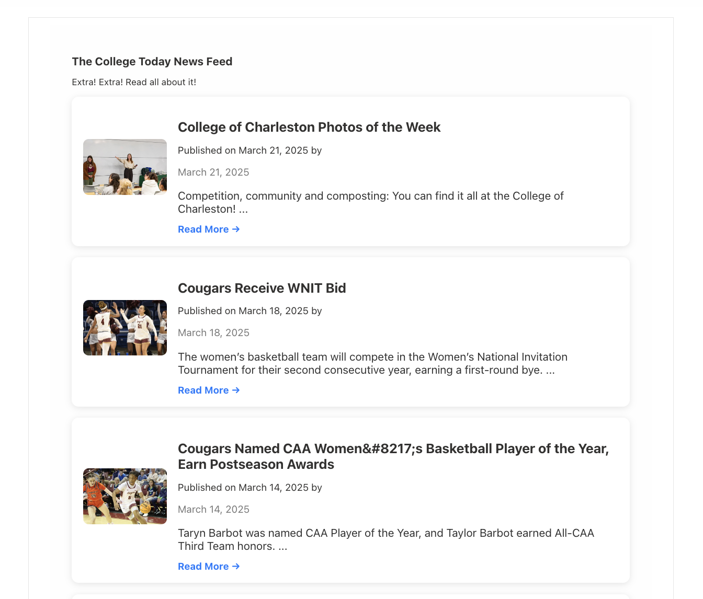
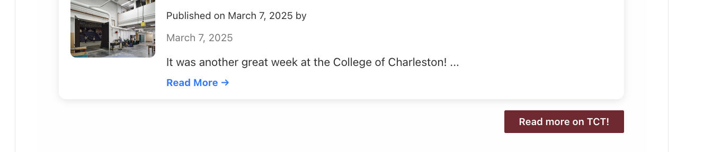

# SharePoint Framework (SPFx) WordPress-Specific RSS Feed Web Part

This SharePoint Framework (SPFx) Web Part allows you to fetch and display posts from a WordPress site's RSS feed using the WordPress REST API. Users can filter posts by tags, categories, post title patterns, and date ranges. This component is ideal for SharePoint environments that need to embed dynamic blog content from a WordPress site.

## ✨ Features

- 🔗 Connect to any WordPress site URL
- 🏷️ Filter posts by tags and categories
- 📆 Limit posts by date range (e.g., last 7 days)
- 🔍 Filter post titles with regular expressions (wildcard matching)
- ⚖️ Combine filters using `AND` / `OR` logic
- 🔄 Refresh feed and clear feed settings with one click
- 📃 Fully integrated with Fluent UI for a responsive SharePoint look and feel

## 🛠️ Usage
Once the Web Part is added to a page:

1. Enter your WordPress site URL (e.g. https://example.com)
2. Fetch site information (will fail if feed is not available). Once site information is fetched you can:
3. Set limits: # posts, # days back
4. Select desired tags or categories to filter by. **These are multiselect dropdowns populated from your site's available tags and categories.**
5. Optionally enter a regular expression to filter post titles. 
6. Choose AND or OR to define how tag/category filters combine.
7. Choose your layout: List | Grid -- **Note here that images will only display if the parent post has associated media**
8. Click Update Feed.
9. Use Clear Filters to reset everything.

## 📸 Demo Screenshots
### Basic Settings (feed title, description, link)

### WordPress Site URL (to pull the feed)

### Connect to the site and fetch its info (tags, categories, etc.). Choose feed settings.

###  Save those settings!

###  View your feed! 

### Test your link if you configured one!

## Used SharePoint Framework Version

## Applies to

- [SharePoint Framework](https://aka.ms/spfx)
- [Microsoft 365 tenant](https://docs.microsoft.com/en-us/sharepoint/dev/spfx/set-up-your-developer-tenant)

> Get your own free development tenant by subscribing to [Microsoft 365 developer program](http://aka.ms/o365devprogram)

## Prerequisites

### For using: 

> Have a Wordpress site in mind that allows access to the /wp-json path for RSS feed consumption
> Have a SharePoint Online site

### For developing:  

- [Node.js (LTS version)](https://nodejs.org/)
- [Yeoman and SPFx Generator](https://docs.microsoft.com/en-us/sharepoint/dev/spfx/set-up-your-development-environment)
- SharePoint Online Developer site (or compatible local workbench)

## Solution

| Solution    | Author(s)                                               |
| ----------- | ------------------------------------------------------- |
| sharepoint-wordpress-rss-feed | Austin Hunt, austinjhunt.com |

## Version history

| Version | Date             | Comments        |
| ------- | ---------------- | --------------- | 
| 1.0     | April 03, 2025 | Initial release |

## Disclaimer

**THIS CODE IS PROVIDED _AS IS_ WITHOUT WARRANTY OF ANY KIND, EITHER EXPRESS OR IMPLIED, INCLUDING ANY IMPLIED WARRANTIES OF FITNESS FOR A PARTICULAR PURPOSE, MERCHANTABILITY, OR NON-INFRINGEMENT.**

---
 
## Further Development
- Clone this repository
- Ensure that you are at the solution folder
- in the command-line run:
  - **npm install**
  - **gulp serve** 

 
